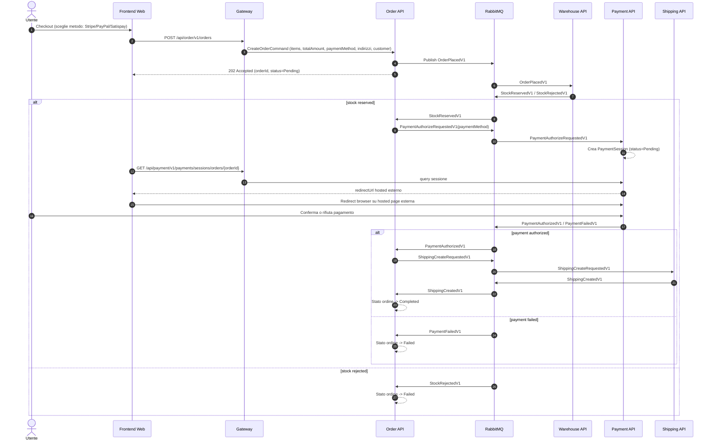
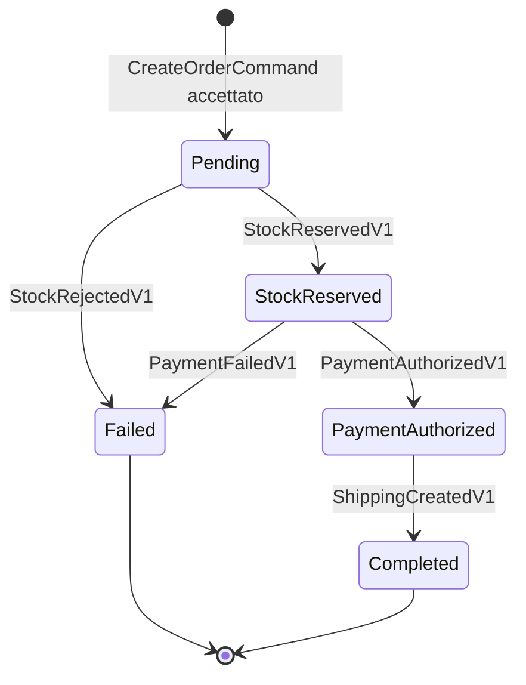

# Checkout Flow (Dettaglio Operativo)

Questo documento descrive in dettaglio il checkout corrente, completamente event-driven lato backend, con hosted payment esterno (mockabile oggi, sostituibile con PSP reale via configurazione).

## 1. Obiettivi del flusso
- Nessuna gestione di dati carta/pagamento sensibili nel backend applicativo.
- Orchestrazione ordine asincrona via RabbitMQ/Wolverine.
- Decoupling tra microservizi (niente chiamate HTTP dirette service-to-service nel checkout).
- Possibilita' di passare da mock hosted page a provider reale cambiando solo configurazione URL/template.

## 2. Flusso end-to-end (visione utente + backend)

## 3. Macchina a stati ordine

Nota operativa aggiornata:
- E consentita una transizione manuale `Completed -> Failed` solo da backoffice e solo come override esplicito operatore.
- Questa eccezione e limitata al canale amministrativo e non altera il flusso automatico event-driven.

## 4. Confini e responsabilita'
- Frontend Web:
  - Raccoglie i dati checkout non sensibili (customer, indirizzi, items, metodo pagamento).
  - Invia `CreateOrder`.
  - Effettua polling della payment session per ottenere `redirectUrl`.
  - Redireziona il browser verso hosted payment page.
- Order API:
  - Valida input e persiste stato iniziale ordine.
  - Pubblica `OrderPlacedV1`.
  - Reagisce agli eventi stock/payment/shipping e aggiorna lo stato.
- Warehouse API:
  - Riserva stock su `OrderPlacedV1`.
- Payment API:
  - Crea `PaymentSession` pending con `paymentMethod`.
  - Espone sessione e `redirectUrl`.
  - Hosted mock page (`/v1/payments/hosted/{paymentMethod}`) che simula authorize/reject.
- Shipping API:
  - Crea spedizione dopo pagamento autorizzato.
  - Espone API gestionali per lista spedizioni, dettaglio per orderId e aggiornamento stato in backoffice.

- Cart API:
  - Consuma `OrderCompletedV1` per chiudere il carrello sorgente e creare un nuovo carrello vuoto.

## 5. Contratti principali
- HTTP:
  - `POST /api/order/v1/orders`
  - `GET /api/payment/v1/payments/sessions/orders/{orderId}`
  - `POST /api/payment/v1/payments/sessions/{sessionId}/authorize`
  - `POST /api/payment/v1/payments/sessions/{sessionId}/reject`
  - `GET /api/payment/v1/payments/hosted/{paymentMethod}`
  - `GET /api/shipping/v1/shipments`
  - `GET /api/shipping/v1/shipments/orders/{orderId}`
  - `POST /api/shipping/v1/shipments/{shipmentId}/status`
- Eventi integrazione:
  - `OrderPlacedV1`
  - `StockReservedV1`
  - `StockRejectedV1`
  - `PaymentAuthorizeRequestedV1`
  - `PaymentAuthorizedV1`
  - `PaymentFailedV1`
  - `ShippingCreateRequestedV1`
  - `ShippingCreatedV1`
  - `OrderCompletedV1`
  - `OrderFailedV1`

## 6. Configurazione hosted payment
- `PAYMENT_PROVIDER_MODE=redirect` (default) per sessione hosted.
- `PAYMENT_HOSTED_GATEWAY_BASE_URL` per URL base hosted mock.
- `PAYMENT_STRIPE_CARD_REDIRECT_URL_TEMPLATE`
- `PAYMENT_PAYPAL_REDIRECT_URL_TEMPLATE`
- `PAYMENT_SATISPAY_REDIRECT_URL_TEMPLATE`
- Token supportati nei template: `{sessionId}`, `{orderId}`, `{paymentMethod}`, `{returnUrl}`.

## 7. Sicurezza: cosa NON passa dal backend
- PAN/carta, CVC, dati wallet/provider non transitano ne' vengono persistiti nei servizi backend.
- Il backend tratta soltanto:
  - identificativi ordine/sessione,
  - metodo di pagamento selezionato,
  - importo ordine,
  - esito autorizzazione/rifiuto.

## 8. Failure mode principali
- Stock non disponibile:
  - Warehouse pubblica `StockRejectedV1` -> ordine `Failed`.
- Metodo pagamento non supportato:
  - Payment rifiuta (`PaymentFailedV1`) -> ordine `Failed`.
- Timeout/ritardi asincroni:
  - Frontend continua polling ordine/sessione.
  - Lo stato finale viene raggiunto quando tutti gli eventi necessari sono consumati.

## 9. Impatto operativo
- Per passare dal mock a PSP reale non serve cambiare il codice dominio/order workflow:
  - si aggiorna la configurazione redirect template/base URL,
  - si integra callback/webhook provider verso endpoint dedicati payment (se richiesto dal PSP),
  - si mantiene invariato il contratto eventi verso `Order`.
